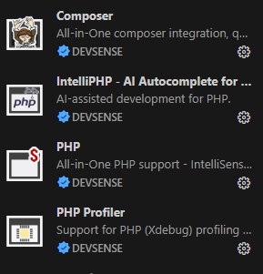
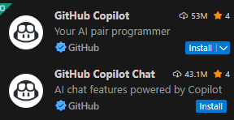

 

  

## LowCode платформа для расширения функциональности 1С

Выполняем нестандартную интеграцию 1С с другими системами
- Идеально подходит для клиентов сервиса 1С-Fresh
- Добавляем нестандартный функционал без необходимости уходить с базовой версии
- Создаем, изменяем и удаляем любые документы в соответствии с бизнес-правилами
- Импортируем и экспортируем документы и данные 1С в любых форматах и через любые протоколы
- Автоматическая коррекция проводок в нестандартных случаях учета
- Работаем по прямому быстрому интерфейсу OData
- Не пользуемся дополнительными расширениями, обработками и отчетами 1С
- Не нужно проходить аудит 1С

## Ограничения базовых версий 1С

Когда вновь созданная компания начинает работать, она, как правило, использует базовую версию 1С-бухгалтерии. Базовая версия не дорогая и закрывает почти все потребности компании в начале развития. Но у базовой версии есть ограничения. 

Основные ограничения:
- Однопользовательский режим: Только один пользователь может одновременно работать с одной информационной базой. Для работы нескольких специалистов необходима версия ПРОФ и дополнительные клиентские лицензии. 
- Ограничение на одну организацию: В одной информационной базе можно вести учет только одной организации. Для ведения учета нескольких компаний потребуется создавать отдельные базы для каждой.
- Невозможность доработки: Базовая версия имеет типовую конфигурацию, которую нельзя изменять под уникальные бизнес-процессы. Разрешены только внешние отчеты и обработки
- Отсутствие клиент-серверного режима: Программа не поддерживает работу на сервере с использованием баз данных, как в клиент-серверном режиме
- Ограничения по доступу: Невозможна работа в системе через веб-браузер или через внешнее соединение
- Отсутствие РИБ: Нельзя создать распределенную информационную базу, что исключает работу филиалов в единой системе

## Сервис 1С-Фрэш

Для преодоления некоторых ограничений 1С создала сервис 1С-Фрэш

Теперь с базовой версией 1С могут работать несколько пользователей. Доступ осуществляется по https или в режиме тонкого клиента с любого компьютера. Кроме того, предоставляется сервис архивирования и бакапов. При использовании 1С-Фрэш многие вещи становятся более легкими и логичными. 

Благодаря удобству и функциональности сервис 1С-Фрэш стал очень популярным среди пользователей 1С.

Но все равно некоторые ограничения остаются:
- В частности, невозможно дорабатывать базу 1С
- Весь дополнительный функционал реализуется с помощью расширений
- Расширения пишуться на языке 1С сертифицированным cпециалистом 1С
- Для расширений действуют строгие ограничения и они должны проходить обязательный аудит
- Запрос на аудит может подать только организация-партнер 1С
- Разработанные расширения, прошедшие аудит, как правило, предоставляются на платной основе

## Cross System - дорожная карта

Для преодоления указанных ограничений создан сервис Cross System - www.cross-sys.ru

### www.cross-sys.ru
- основной сайт сервиса
- маркетинговая информация
- описания тарифов 
- ссылки на приложение amin и task

### admin.cross-sys.ru
- регистрация пользователей
- настройка источников и приемников данных
- настройка бизнес-процессов
- настройка конечных пользователей
- личный кабинет, кошелек, пополнение кошелька

### task.cross-sys.ru
- аутентификация конечного пользователя
- выдача списка доступных ему процессов
- выбор процесса
- выдача списка задач в рамках процесса
- запуск задачи в тестовом и рабочем режиме
- получение отчета о выполнении задачи

### Источники/приемники данных 
Бизнес-процесс для работы может использовать источники-приемники данных, которые настраиваются отдельно.

- Папка с файлами (CSV, JSON, XML)
- PHP PDO
- 1C OData

В рамках бизнес-процесса источник/приемник данных может быть указан, как ReadOnly.

### Бизнес-процессы
Бизнес-процессы отвечают за обмен информацие между источниками и приемниками данных по определенным правилам. Для бизнес-процесса нужно определить, как формируется список задач, и как выполняется конкретная задача.

- XCustomProcess - настраиваются источники/приемники данных, а весь код вносится в настройки - определяется пользователем.Требуется знание PHP, архтектуры системы и особенностей источников данных
- XImportExportProcess - настраивается источник данных, приемник данных, соответствия полей и правила форматирования.
- XEditProcess - настраивается источник данных (он же приемник), и правила изменения данных
- XEditBuhProcess - вариация XEditProcess для корректировки проводок в документах 1С

## Соглашения по разработке

## vscode

Основной инструмент разработки - vscode c расширениями от DEVSENSE 

  

Допускается использовать ИИ:
- Для программирования - copilot
- Для справки - [https://chat.qwen.ai/](https://chat.qwen.ai/)

  

  

### Версия PHP

В качестве хостинга выбран сервис timeweb.ru - это важно, так как от этого зависит версия PHP

[https://task.cross-sys.ru/phpinfo.php](https://task.cross-sys.ru/phpinfo.php)

PHP Version 8.2.28

### db_cross_config
- База данных с клиентами сервиса и их настройками
- MySQL 8.0 (на хостинге по умолчанию)

### db_cross_log
- База данных с логами работы системы и пользователями
- MySQL 8.0 (на хостинге по умолчанию)

### www.cross-sys.ru
- обычный лэндинг (HTML, CSS, JS)
- допускается использовать php и db_cross_config в режиме ReadOnly (например, для тарифов)
- должна быть подключена какая-то метрика (например Яндекс-метрика)
- должна продвигаться маркетинговыми инструментами (например, Яндекс-Директ)

### admin.cross-sys.ru
- построена на технологии Laravel/Orchid
- использует и редактирует db_cross_config 
- ведет логгирование действий пользователей в db_cross_log
- допускаются только стандартные библиотеки и расширения PHP и библиотеки экосистемы Laravel/Orchid

### task.cross-sys.ru
- пока построена на PHP, HTML, CSS без внешних зависимостей и JS
- использует db_cross_config в режиме ReadOnly
- ведет логгирование действий пользователей в db_cross_log
- допускаются только стандартные библиотеки и расширения PHP 

## Работа с репозиториями

Весь код проекта хранится в аккаунте

[https://github.com/cross-system](https://github.com/cross-system)

### cross-system.github.io - Public
- Репозиторий с описанием проекта

### cross_www - Private
- Репозиторий приложения www.cross_sys.ru

### cross_admin - Private
- Репозиторий приложения - admin.cross_sys.ru

### cross_task - Private
- Репозиторий приложения - task.cross_sys.ru

#### Группа IT-профессионалов выполняет сложные задачи в сфере IT

Беремся только за безнадежные случаи:
- Нестандартные протоколы
- Недокументрованные API и интерфейсы
- Нестандартная миграция данных
- Устаревший неподдерживаемый код
- Экзотические языки программирования
- Плавающие и необъяснимые сбои
- Экспертиза софта, инфраструктуры и инцидентов

Входной консультант - Михаил Долгих

Свяжитесь со мной - <a href="mailto:cross-system@mail.ru">cross-system@mail.ru</a>

**Сross System** - IT-интегратор нового типа
 
